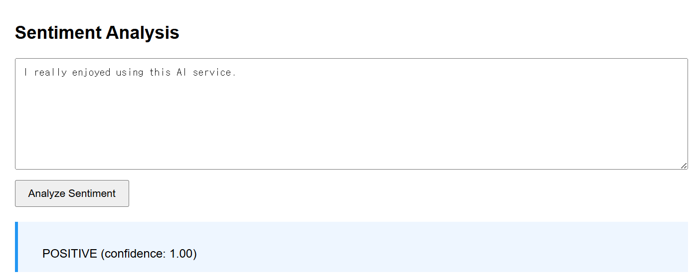

# 나만의 AI 사이트 (Django)

---
## 사용 모델 (3개 이상)

### 1. facebook/bart-large-cnn
- **태스크**: Summarization (요약)
- **입력 예시**: Artificial intelligence (AI) has become one of the most transformative technologies of the modern era. It is widely applied in various industries,
including healthcare, finance, transportation, and education. In healthcare,
AI assists doctors in diagnosing diseases more accurately and efficiently.
In finance, it is used for fraud detection and algorithmic trading.
As AI continues to evolve, it is expected to further impact society,
raising both opportunities and ethical challenges.
- **출력 예시**: Artificial intelligence (AI) has become one of the most transformative technologies of the modern era. In healthcare, it assists doctors in diagnosing diseases more accurately and efficiently. In finance, it is used for fraud detection and algorithmic trading.
- 실행 화면 예시: 

### 2. distilbert-base-uncased-finetuned-sst-2-english
- **태스크**: Sentiment Analysis (감정 분석)
- **입력 예시** I really enjoyed using this AI service.
- **출력 예시** POSITIVE (confidence: 1.00)
- 실행 화면 예시: 

### 3. distilgpt2
- **태스크**: Text Generation (텍스트 생성)
- **입력 예시**: The future of artificial intelligence
- **출력 예시**: A new book by David Rizzo, published this week at MIT Press on behalf and a member-only publisher called "The Future of Artificial Intelligence."
- 실행 화면 예시: 


---
## 로그인 제한(Access Control)

- 비로그인 사용자는**1개 탭만 사용 가능** (generate 탭만 사용 가능)
- 제한 탭 접근 시**“로그인 후 이용해주세요” alert 후 로그인 페이지로 이동**
- 로그인 성공 시**원래 페이지로 복귀(next)**

---
## 구현 체크리스트

- [✅] 탭 3개 이상 + 각 탭 별 URL 분리
- [✅] 각 탭: 입력 → 실행 → 결과 출력
- [✅] 에러 처리: 모델 호출 실패 시 사용자에게 메시지 표시
- [✅] 로딩 표시(최소한 “처리 중…” 텍스트라도)
- [✅] 요청 히스토리 5개
- [✅] `.env` 사용 (토큰/API Key 노출 금지)
- [✅] `README.md`에 모델 정보/사용 예시/실행 방법 작성 후 GitHub push

### 로그인 제한 체크
- [✅] 비로그인 사용자는 1개 탭만 접근 가능
- [✅] 제한 탭 접근 시 alert 후 로그인 페이지로 redirect
- [✅] 로그인 성공 시 원래 페이지로 복귀(next)

---
## 실행 방법

1. 가상환경 생성 및 활성화
```bash
python -m venv venv
source venv/Scripts/activate   # Windows
```
2. 패키지 설치
```bash
pip install -r requirements.txt
```
3. 환경 변수 설정
프로젝트 루트에 .env 파일을 생성하고 HuggingFace 토큰을 추가합니다.
```env
HF_TOKEN=your_huggingface_token
```
4. 데이터베이스 마이그레이션
```bash
python manage.py migrate
```
5. 서버 실행
```bash
python manage.py runserver
```

6. 접속
```
http://127.0.0.1:8000/
```

---
## 로그인 안내
- 본 프로젝트는 Django 기본 인증 시스템을 사용합니다.
- 테스트용 계정은 Django 관리자(admin) 페이지에서 생성할 수 있습니다.

```bash
python manage.py createsuperuser
```

---
### 🔎 참고
- 비로그인 사용자는 **Text Generation 탭만 사용 가능**
- 로그인 시 **요약 / 감정 분석 / 텍스트 생성** 기능 모두 이용 가능하며,
  각 기능별로 최근 5개의 요청 히스토리가 저장됩니다.